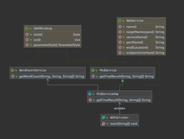

# Decentralized Word Count
## Overview:

In this projct, I will simulate a multi-server processing system to allow for the processing of a text file across multiple systems. The resulting cloud software will take as input a single text document, split the data across multiple systems, process the data and return information on the document to the client.

## Technology:
- Language: Java
- Develop Tool: Intellij IDEA, Docker
- Build Tool: Apache maven, Docker-compose
- Cloud Service: AWS EC2
- Protocol: RPC 

## Workflow and Data Flow:


## Architecture:

- In the cloud part, I use an EC2 instance to run my server program. I create a cluster that includes 4 nodes. Every node can communicate with each other. Every node can become a leader.
- The mid server is the only node to provide web services to the external network. The mid-server just does one thing to elect a leader and send a request to the leader server. Mid-server doesn’t process data.
- When the leader receives the request, it will split data and distribute the sub-task to other nodes. 
- When other nodes receive the request from the leader, they will process the data, and return the result to the leader.
- After all nodes respond, the leader will merge all results, and calculate the final result.
- All servers and mid-server run in different docker containers.
- Client read local file and send file content to mid-server. 
- After mid-server get result from leader server, mid-server send result to client.

## UML:

### Client UML:


### Mid-Server UML:


### Server UML:


## How to Implement:
### Server:
- Server has four functions: split data, call web services, data process, merge result. When the server is the leader, it should do all the functions. When the server is accepter, it just does the data process.
- Use RPC to realize the communication between nodes. Each server will publish a web service. 
- All the servers run in a sub-net, so the external network must through the mid server to access them.
- I use TreeMap to record the number of each word.
- Webservice doesn’t support transport Map object. So I convert TreeMap to String and return to the caller.
- When Leader server get response, it should convert String to TreeMap, then merge TreeMap.
- I use Multi-threaded concurrency to send requests to other nodes. In this way, I don’t waste time to wait the node to response.

### Mid Server:
- The mid server uses pseudo-random to elect leader.
- Mid server publishes a web service that is used for the client.
- Mid Server also runs in the sub-net, but it maps to TCP port 3000. So, the client can access it from external network.
  
### Client:
- Client has tree functions: read file, call web service and analyze data.
- My client application needs users to enter the hostname of the web service, I think it is a little complicated for users. But each time I start the ec2 instance that will be allocated a new IP address. Unless I don’t stop my ec2 instance, I can’t config the hostname for the client app.
- I try to use AWS java JDK to get ec2 instance information in order to dynamic config hostname. But this way is too complicated for a client app.

### About Docker:
- I use docker-compose.yml to deploy my application to container.

- My Dockerfile


# Run the project by using your own EC2

## Prerequisites:
- Launch a EC2 instance.
- Install docker, docker-compose, unzip on EC2 instance
- Can use ssh to connect to the EC2 instance.

## Deploy Server to EC2 Instance:
- Open local Terminal and use scp to upload WordCountInstall.zip to the EC2 instance.
```
scp -i /directory/to/abc.pem /your/local/file/to/copy ec2-user@ec2-xx-xx-xxx-xxx.compute-1.amazonaws.com:path/to/file
```
- Use ssh connect to EC2 instance and unzip WordCountInstall.zip
- In the ec2 terminal, navigate to the server code directory:
```
cd WordCountInstall/
```
- Using the following command to start the server
```
docker-compose up -d
```
The first-time start will build a subnet, 5 images and 5 containers. 
I define the docker subnet to use 172.20.0.0/16 range. If you have network use the same range, please remove it.

## Run the client app:
- Open local terminal and navigate to client code directory.
```
cd <Your Dirctory>/wordcountclient
```
- Use the following command to build the project.
```
mvn package
```
- Use the following command to run the application.
```
mvn exec:java -Dexec.mainClass="com.example.App"
```
- Copy “Public IPv4 DNS” of the EC2 Instance.
- Use “Public IPv4 DNS” as HostName.


